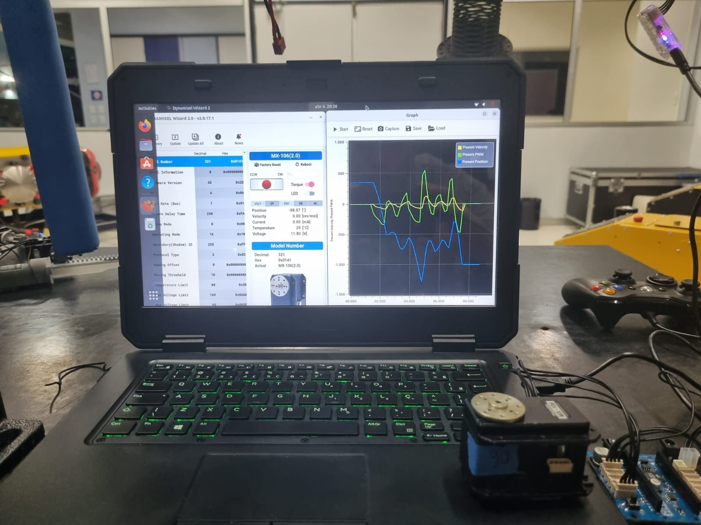

# system-identification-servomotor
System identification for servo motors using toolbox of MATLAB

## Experimental Setup
  

## Results
  

## Contacts information

**João Vitor S Mendes**
- Email: joao.mendes@aln.senaicimatec.edu.br
- GitHub: https://github.com/vitorsmends
- Lattes: http://lattes.cnpq.br/1253937974490834
- LinkedIn: https://www.linkedin.com/in/vitorsmends

**João Gabriel Calmon**
- Email: joao.calmon@aln.senaicimatec.edu.br
- GitHub: https://github.com/GabrielCalmon
- Lattes: http://lattes.cnpq.br/3714599132684846

** Emanuel Benínio Cajueiro - Advisor**
- Email: emanuel.cajueiro@fieb.org.br
